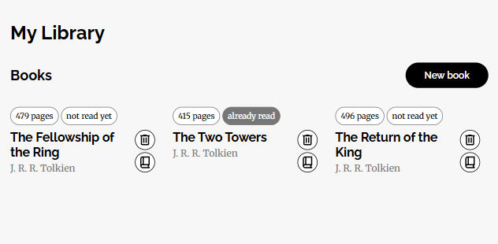

# 📚 Library

[🇺🇸 English](README.md) | 🇧🇷 Português

Um pequeno app web para organizar os livros que você tem e marcar quais já leu. Criado para praticar **arrays em JavaScript** e para conseguir um layout totalmente **responsivo usando apenas CSS, sem media queries**.

Faz parte do currículo do [The Odin Project](https://www.theodinproject.com) (Projeto: Library).

**[Demo online](https://biroveyou.github.io/library-odin/)**



## Funcionalidades
- Adicionar um livro por um formulário em modal (título, autor, número de páginas e status de leitura)
- Alternar um livro entre "lido" e "ainda não lido" com um clique
- Remover livros da biblioteca
- Começa com três livros de exemplo para a estante não ficar vazia
- Campos obrigatórios e limites de entrada validados pelo formulário
- Estante que se adapta a qualquer tamanho de tela

## O que eu pratiquei
- Armazenar e manipular objetos em **arrays** (`push`, `splice`, `findIndex`)
- Construtores de objetos e **métodos no prototype** (`Book`, `toggleHaveRead`)
- IDs únicos com `crypto.randomUUID()`
- Criar elementos dinamicamente com a **API do DOM**
- O elemento nativo `<dialog>` do HTML e a validação de formulário embutida
- Layout responsivo em **CSS puro**, sem media queries
- `CSS Grid com repeat(auto-fill, minmax(...))` para responsividade sem media queries.

## Tecnologias
HTML5 · CSS3 · JavaScript (puro)

## Como Começar
Não é necessário build nem dependências.

```bash
git clone https://github.com/biroveyou/library-odin.git
cd library-odin
```

Depois, abra o `index.html` no navegador (ou use uma ferramenta como o Live Server do VS Code).

## Estrutura do Projeto
```
library-odin/
├── index.html
├── style.css
├── script.js
├── screenshot.png
├── fonts/
└── icons/
```

## Autor
Daniel Macêdo · [LinkedIn](https://www.linkedin.com/in/daniel-macêdo) · [GitHub](https://github.com/biroveyou)